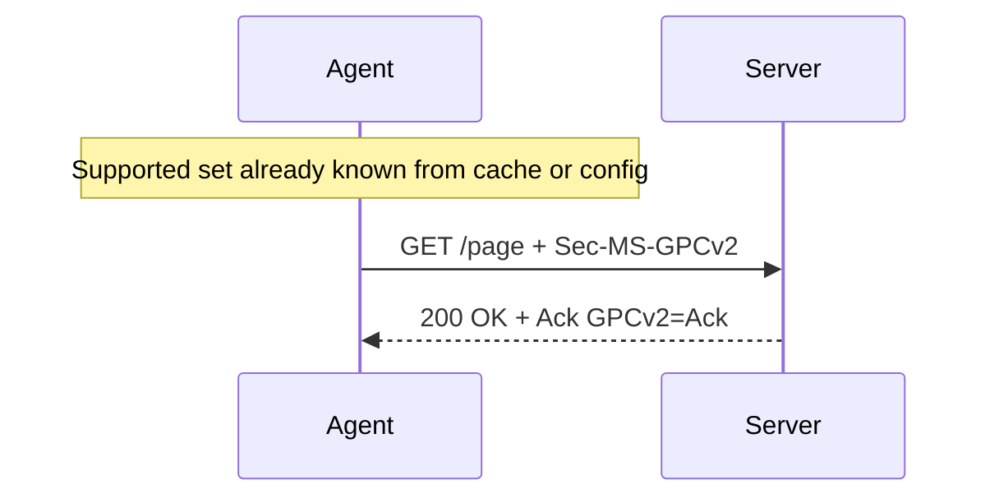
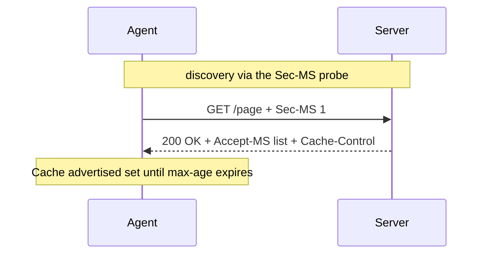
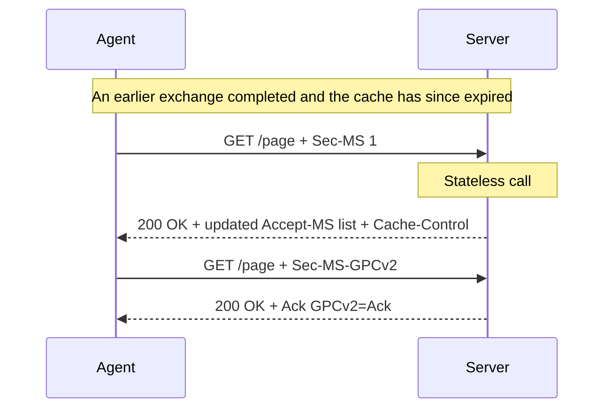
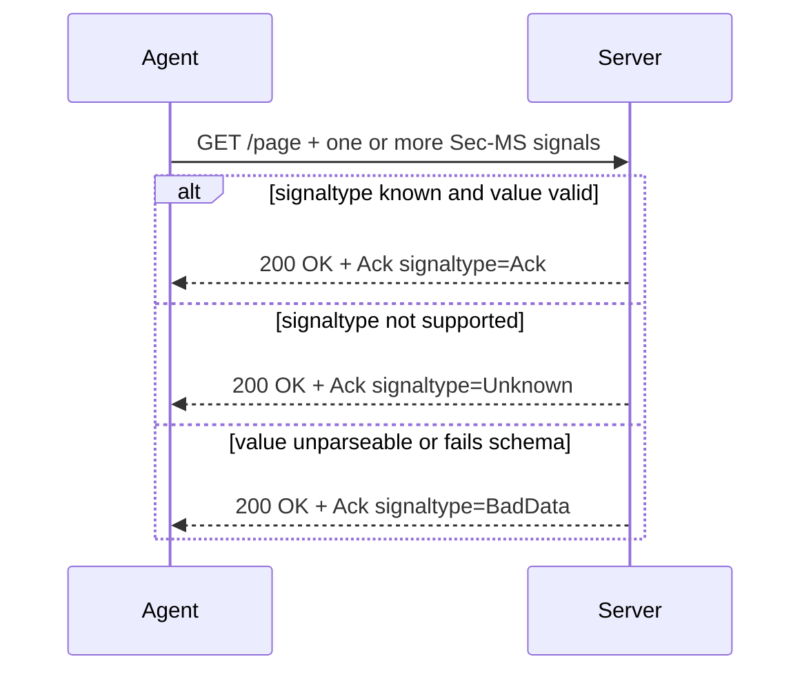

# ARD — MySignals: Optional Discovery & Signal Acknowledgement

> Architecture Decision Record for the [MySignals](https://mysignals.org/spec/) handshake.

|                   |                                                                                |
| ----------------- | ------------------------------------------------------------------------------ |
| **Status**        | Proposed                                                                       |
| **Spec baseline** | MySignals — Editor's Draft, 30 January 2026 (The Mee Foundation)               |
| **Scope**         | Discovery/negotiation of supported signaltypes, and per-signal acknowledgement |
| **Out of scope**  | The on-the-wire encoding of signals (unchanged — see §3)                       |

---

## 1. Context and Problem Statement

The current specification (§3) defines a strict three-step handshake, modelled on Client Hints:

1. **Initiate** — the agent sends `Sec-MS: 1` on a GET request to announce framework support.
2. **Acknowledge** — if the server supports the framework it responds with `Accept-MS`, listing supported signaltypes, each carrying a `;def=` definition URI.
3. **Send signal(s)** — the agent sends the mutually acceptable subset. Per the wire format (§8.14), each signal value is JSON-encoded into an `Sec-MS-<signaltype>` header, optionally referencing a Signal Parameters Resource (SPR) through a `def=` URL.

### 1.1 Legal motivation

Several MySignals signaltypes are not cosmetic. `GPCv2` carries the Global Privacy Control "Do Not Sell or Share" semantic, which is **legally binding** under the CCPA and comparable state laws. When a signal has legal weight, the protocol around it must be predictable, low-latency, evidentiary, and robust at internet scale. The current handshake has four gaps that undermine those properties.

### 1.2 Problems with the current design

**P1 — Discovery is mandatory, and it costs a round trip before any signal can be sent.**
An agent that wants to assert a legally binding opt-out cannot do so on its first request; it must first probe (`Sec-MS: 1`), wait for `Accept-MS`, and only then send `Sec-MS-GPCv2` on a subsequent request. For a signal whose entire purpose is to be expressed _as early and reliably as possible_, gating it behind a negotiation round trip is the wrong default.

**P2 — There is no cacheable, site-wide, auditable view of what a server supports.**
Because discovery is purely in-band, every agent (and every origin/path) re-negotiates from scratch, and no third party — auditor, regulator, researcher — can enumerate a site's declared support without driving live traffic against it. Compliance verification for a legally binding signal should not require traffic generation.

**P3 — The handshake implies session-like state that HTTP does not provide.**
A "completed handshake" has no natural home in a stateless protocol fronted by CDNs, retried by clients, and spread across multiple tabs and load-balanced backends. If a server expects a prior probe before honouring a submitted signal, the design becomes fragile exactly where it must be most reliable.

**P4 — Signals are sent into a void; the agent gets no confirmation.**
After step 3 the agent has no way to learn whether the server recognised the signaltype, accepted its value, or silently dropped it. For a legally binding opt-out this is unacceptable: the agent needs positive evidence of receipt. For malformed or unsupported signals the agent has no feedback with which to stop wasting bandwidth or to correct a bad value.

This ARD proposes two complementary improvements: an optional **in-band** discovery mechanism addressing P1 and P3, and a per-signal acknowledgement mechanism addressing P4. P2 — traffic-free, site-wide auditability — is not solved by in-band discovery and is recorded as an open limitation (§8, §9).

---

## 2. Decision Drivers

- Latency for the common case, especially first-request delivery of time-sensitive signals.
- Cacheability and CDN/edge friendliness.
- Site-wide auditability of declared support.
- Statelessness and robustness under retries, multiple tabs, and load balancing.
- Positive, machine-readable confirmation of signal receipt.
- Minimising the fingerprinting surface, an explicit design goal of the base spec (§1.2).

---

## 3. Constraints and Assumptions

- **Existing header semantics are preserved.** `Sec-MS: 1` remains the framework probe; `Accept-MS` remains the supported-signaltypes advertisement carrying `;def=` URIs.
- **`Sec-` prefix is user-agent controlled.** `Sec-MS` is a forbidden header name that only the user agent may set, so scripts cannot forge it. Any new trust-bearing header preserves this property.

---

## 5. Decision

- **Improvement 1 — Optional, cacheable, stateless discovery.** Discovery stops being a mandatory first step. The supported-signal set is obtained **in-band**, through the existing `Sec-MS` probe, and the result is cacheable. Both discovery and submission are stateless. Re-requesting the supported set after an earlier exchange is always valid.
- **Improvement 2 — Per-signal acknowledgement.** Every submitted `Sec-MS-*` signal is answered with an `Ack` header entry reporting `Ack`, `Unknown`, or `BadData`.

---

## 6. Improvement 1 — Optional, cacheable discovery

### 6.1 Discovery becomes optional

An agent MAY submit `Sec-MS-*` signals **without any prior discovery**. Discovery exists to let an agent learn what is worth sending; an agent that already knows (from cache, from a prior fetch, or from out-of-band configuration) MAY skip it and submit directly. This directly addresses P1: a legally binding `Sec-MS-GPCv2` can ride the very first request.



```http
GET /page HTTP/2
Host: example.com
Sec-MS-GPCv2: 1
```

```http
HTTP/1.1 200 OK
Ack: GPCv2=Ack
```

### 6.2 In-band discovery via the `Sec-MS` probe

When an agent does want to discover support, it uses the in-band `Sec-MS` probe. The existing probe is retained unchanged. It is per-request and per-context, so it can reflect capabilities that vary by route, region, or authentication state. The server responds with `Accept-MS`, listing the supported signaltypes and their definition URIs.



```http
GET /page HTTP/2
Host: example.com
Sec-MS: 1
```

```http
HTTP/1.1 200 OK
Accept-MS: GPCv2;def=https://example.com/defs/gpcv2.json, MyTerms;def=https://example.com/defs/myterms-v1.json
Cache-Control: public, max-age=86400
```

> **Syntax note.** `Accept-MS` entries are comma-separated `signaltype;def=URI` pairs. The base spec's §3.2 example mixes spaces and commas; this ARD standardises on comma separation and flags the canonical grammar as an open question (§9).

### 6.3 Submission and discovery are both stateless

The probe establishes no session. A server MUST NOT require a prior probe before honouring a submitted `Sec-MS-*` signal, and MUST NOT depend on remembering that any particular agent has probed before. Each request is interpreted on its own. This addresses P3 and keeps the protocol correct across CDNs, retries, parallel tabs, and load-balanced origins. Any continuity an agent maintains (for example the SDK's stored handshake state, §8.4) is a purely client-side optimisation, not server state.

### 6.4 Caching

Caching is what makes optional discovery cheap. Three layers apply, each with different freshness characteristics.

**1. The discovery result (the `Accept-MS` advertisement).**
This is the _set of supported signaltypes_, which can change over time, so it is cached with a moderate TTL and revalidation. Servers SHOULD emit standard HTTP cache directives — `Cache-Control: max-age`, `ETag`, optionally `stale-while-revalidate`. For the in-band `Accept-MS` advertisement, the agent associates the advertised set with the origin and honours the same directives, so a probe need not be repeated until the cached entry expires.

**2. Signal definition resources (the `def=` targets).**
Per §8.10 these are **immutable**: a server publishes a new version at a new URL (for example `/defs/myterms-v2.json`) rather than mutating an existing one. Because the URL changes on every version bump, a stale definition is impossible, so agents SHOULD cache definition documents aggressively and indefinitely, and servers SHOULD serve them with `Cache-Control: public, max-age=31536000, immutable`. An agent that already holds a definition for a given URL never needs to refetch it.

**3. Client-side storage.**
The JS SDK realises layer 1 with its storage strategies (§8.4): `memory`, `sessionStorage`, and `localStorage` with a 24-hour TTL. These are the implementation of discovery-result caching and bound how long an agent may go between re-discoveries.
Clients are free to implement their own storage strategies, but the JS SDK provides a standardised interface for consistency.

### 6.5 Re-discovery process

Re-requesting the supported set MUST remain valid at any time, including after an earlier exchange has already completed. Because the protocol is stateless (§6.3), a server treats a fresh `Sec-MS: 1` probe exactly as it would a first-time request, returning the current advertisement and applying its normal caching policy. There is no "already handshaked, stop advertising" mode. Agents are expected to re-discover when their cached entry expires, when revalidation against the `ETag` fails, or whenever they choose to.



---

## 7. Improvement 2 — Per-signal acknowledgement (`Ack`)

The current spec acknowledges only _framework support_ (step 2, via `Accept-MS`). It never confirms what happened to the individual signals sent in step 3. This improvement closes P4.

### 7.1 Header and statuses

Whenever a request carries one or more `Sec-MS-<signaltype>` headers, the response MUST include an `Ack` header mapping each received signaltype to exactly one status:

| Status    | Meaning                                                                                             |
| --------- | --------------------------------------------------------------------------------------------------- |
| `Ack`     | Signaltype is recognised, its value is valid against its definition, and it was accepted/processed. |
| `Unknown` | Server does not recognise/support this signaltype.                                                  |
| `BadData` | Signaltype is recognised, but its value is malformed or fails its definition schema.                |

Wire format — an RFC 8941 structured dictionary, one entry per received signaltype:

```http
Ack: GPCv2=Ack, MyTerms=Unknown, AgeProtectv1=BadData
```

The `Ack` header appears **only when `Sec-MS-*` signals were received**. A bare probe (`Sec-MS: 1` with no signals) produces only the `Accept-MS` advertisement, never an `Ack`. Discovery and acknowledgement are orthogonal: an `Ack` may accompany an `Accept-MS` advertisement on the same response when an agent probes and submits in the same request.

### 7.2 How the server decides the status

For each received `Sec-MS-<signaltype>`:

1. If the signaltype is not in the server's supported set → `Unknown`.
2. Otherwise decode the signal value (§8.14). If decoding fails → `BadData`.
3. Otherwise validate the decoded value against the signaltype's definition schema. If validation fails → `BadData`.
4. Otherwise → `Ack`.

The statuses are mutually exclusive and evaluated independently per signaltype, so a single response can mix all three.

### 7.3 Scenarios and examples

**Scenario A — happy path (all accepted).**
A scalar opt-out plus a structured signal carrying an SPR value.

```http
GET /page HTTP/2
Host: example.com
Sec-MS-GPCv2: 1
Sec-MS-MyTerms: {"title":"Signal Parameters Resource","version":"v1","MyTerms":{"contract":"P7012-DDA-1"}}
```

```http
HTTP/1.1 200 OK
Ack: GPCv2=Ack, MyTerms=Ack
```

**Scenario B — `Unknown` (unrecognised signaltype).**
The agent sends a signaltype the server does not support — for example offering `SIOPv2` to a server whose set is `GPCv2`, `MyTerms`. The agent learns to stop sending it.

```http
Sec-MS-SIOPv2: {"client_id":"did:example:123"}
```

```http
Ack: SIOPv2=Unknown
```

**Scenario C — `BadData` (recognised but invalid).** Three representative sub-cases:

_C1 — value is not valid JSON._ The §8.14 wire form requires a JSON-encoded value; this one is unparseable.

```http
Sec-MS-MyTerms: {title: oops not valid json}
```

```http
Ack: MyTerms=BadData
```

_C2 — valid JSON but fails the definition schema._ The SPR requires `version` (§7 of the spec) and it is missing.

```http
Sec-MS-MyTerms: {"title":"Signal Parameters Resource"}
```

```http
Ack: MyTerms=BadData
```

_C3 — recognised signaltype, out-of-range value._ `GPCv2` expresses a single boolean opt-out; `2` is not a valid value.

```http
Sec-MS-GPCv2: 2
```

```http
Ack: GPCv2=BadData
```

**Scenario D — mixed batch.** Independent evaluation yields one entry per signaltype.

```http
Sec-MS-GPCv2: 1
Sec-MS-MyTerms: {"title":"Signal Parameters Resource"}
Sec-MS-SIOPv2: {"client_id":"did:example:123"}
```

```http
Ack: GPCv2=Ack, MyTerms=BadData, SIOPv2=Unknown
```

### 7.4 Sequence



## 8. Consequences

**Positive**

- A legally binding signal such as `GPCv2` can be asserted on the first request, with no negotiation round trip (P1).
- The cacheable `Accept-MS` advertisement lets an agent learn declared support with minimal repeat traffic, advertising only server-side information and therefore adding no client fingerprinting entropy.
- Statelessness makes the protocol correct under CDNs, retries, and multi-tab usage, and removes the fragile notion of a session-bound handshake (P3).
- The `Ack` header gives the agent positive, machine-readable evidence of receipt and an actionable signal to correct or stop sending bad/unsupported data (P4).
- Immutable definition caching means schemas are fetched at most once per version.

**Negative**

- In-band discovery and `Ack` add per-response header overhead.
- In-band-only discovery provides no traffic-free, crawlable view of declared support: an auditor, regulator, or researcher cannot enumerate a site's declared signaltypes without driving live requests against it. **P2 is therefore not addressed by this design and remains an open limitation (§9).**

**Neutral**

- The base three-step handshake is unchanged; all additions are opt-in.
- The `Sec-MS-*` transmission format is untouched.

---

## 9. Open Questions

- Final name and exact grammar of the acknowledgement header. `Ack` collides conceptually with the spec's step-2 "Acknowledge" (`Accept-MS`); `MS-Ack` may be clearer. The structured-dictionary encoding (RFC 8941) should be confirmed.
- Canonical grammar for `Accept-MS` entries (this ARD assumes comma-separated `signaltype;def=URI`).
- How strictly `Unknown` / `BadData` should affect the SDK's transition to `SUBMITTED` versus routing to `ERROR`.
- Whether and how to provide traffic-free, site-wide auditability of declared support (P2) now that discovery is in-band only — for example via an out-of-band attestation or a registry — or whether P2 is accepted as out of scope for this protocol.
- Recommended default TTLs for the discovery result versus the (immutable) definition resources.
