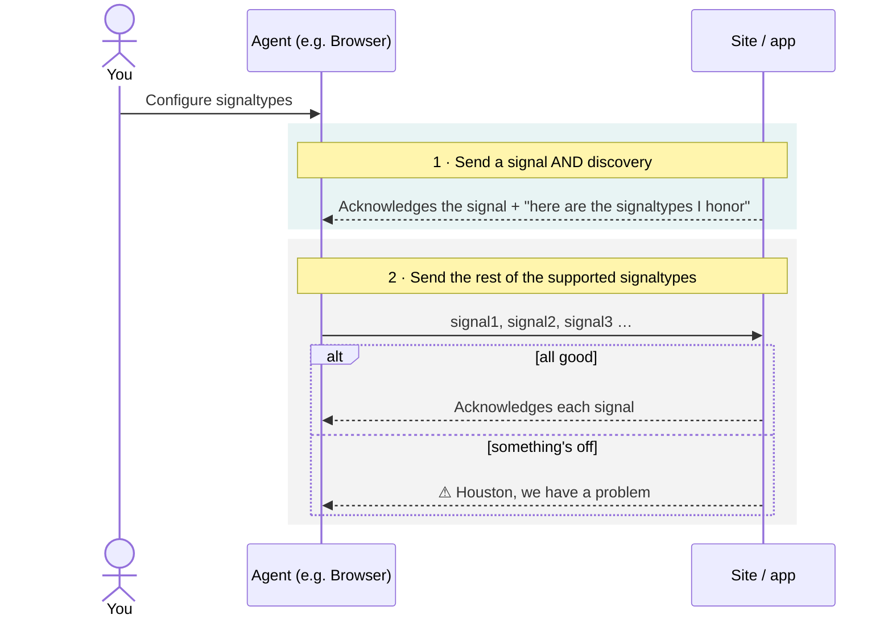

# How it works

You configure your agent and tell it which signaltypes to send on your behalf.

**Step 1 — One opening request.** On its very first request the agent does two things at once:
it sends a signal (a time-sensitive one such as GPC can ride this first request) _and_ asks
which signaltypes the site supports. The site answers in one response — it acknowledges the
signal and tells the agent which signaltypes it honors.

**Step 2 — Send the supported signaltypes.** Knowing what's honored, the agent sends those
signals. The site acknowledges each — and if one can't be honored, it says so
("Houston, we have a problem").

