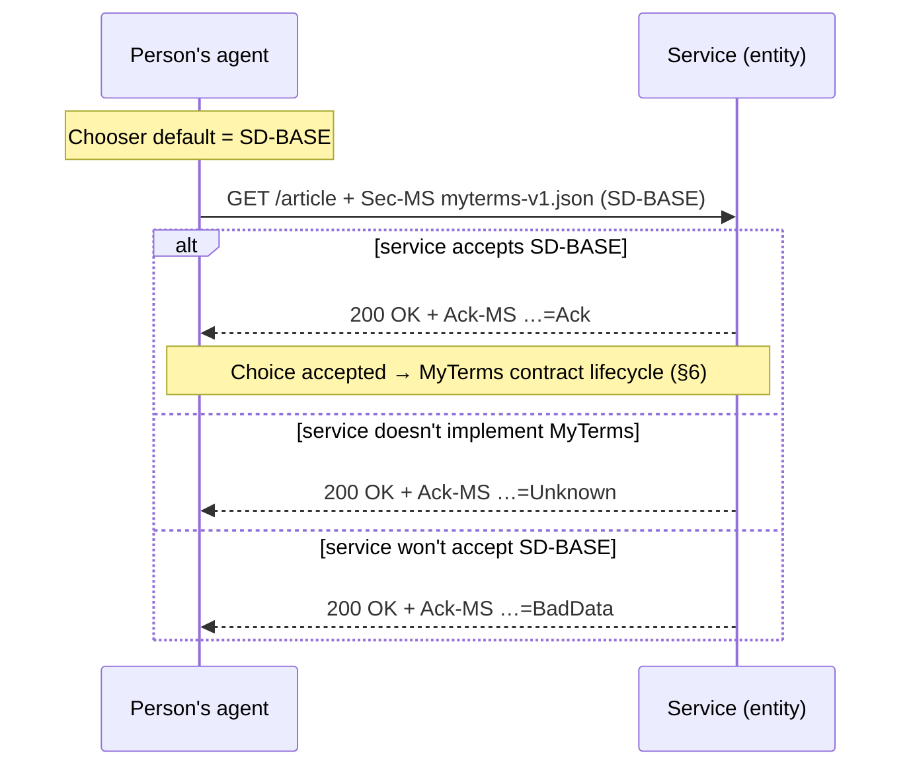
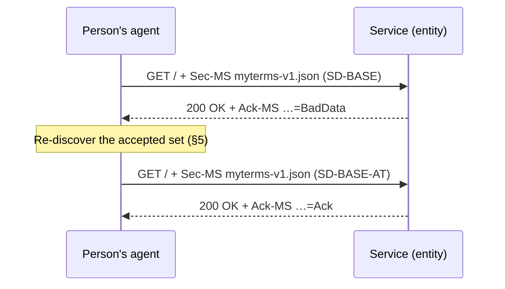
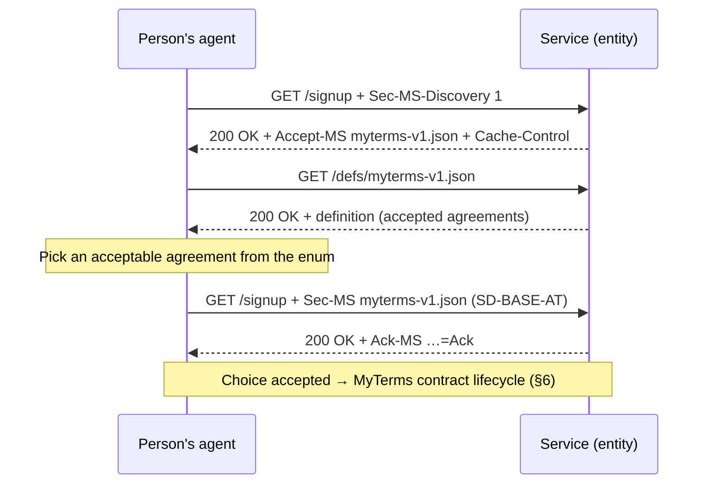
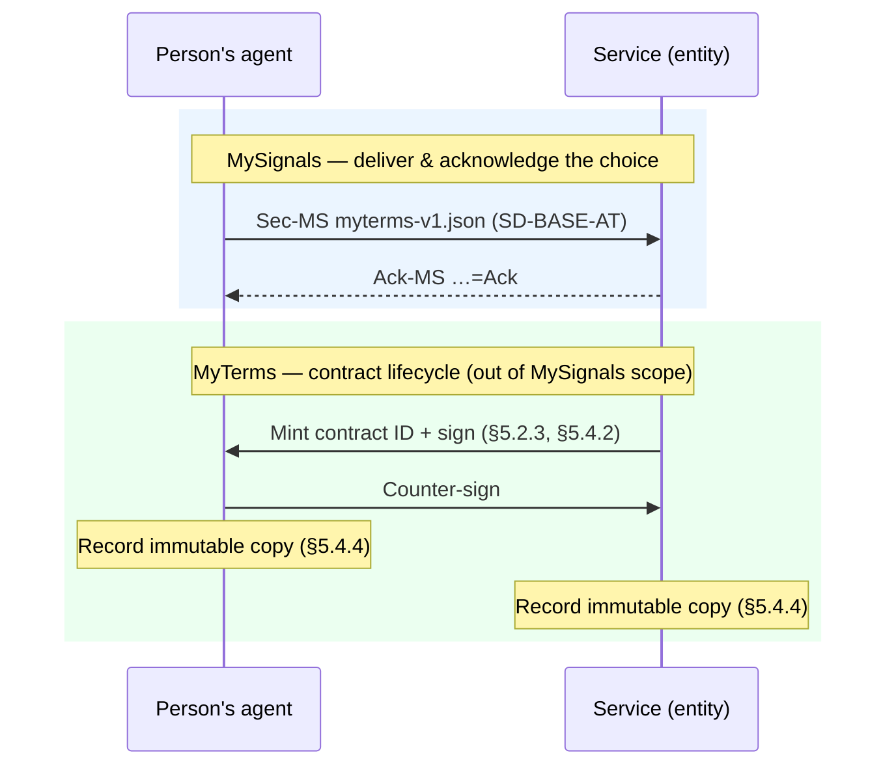

# MyTerms over MySignals

## 1. Introduction

[MyTerms](https://myterms.info/) — **IEEE Std 7012-2025, _Machine Readable Personal Privacy Terms_** [[**IEEEP7012**]](#ref-ieeeP7012) — gives a person a way to **proffer a standardized privacy agreement** to a service, and gives a service a way to **publish the agreements it will accept**. It defines the agreements, the roles, and the contract lifecycle.

- **MySignals is the transport.** A stateless HTTP signalling protocol (see the [MySignals spec](/spec/)).
- **MyTerms is the semantic.** _Which_ standardized agreement applies — `SD-BASE`, `SD-BASE-AT`, `PDC-AI`, and so on.

## 2. MyTerms definition

In IEEE 7012 the **individual is always the first party** and the **entity (service) is the second party** (§4.1, §5.4.3). The person's agent has a **chooser** (it picks a default agreement) and a **proposer** (it presents that agreement to every entity it meets) — §5.2.1.2–§5.2.1.3. The entity, as responding party, "**shall display publicly all terms they would accept**" (§5.3.2) and may accept, reject, or counter the proffer (§5.3.1).

The agreements themselves follow a Creative-Commons-style scheme: a baseline term plus optional annotations. The full roster is combinatorial; the launch subset is five.

| Agreement ID | Kind                        | What it permits                                                                           |
| ------------ | --------------------------- | ----------------------------------------------------------------------------------------- |
| `SD-BASE`    | Relationship (ongoing)      | Service delivery only — no analytics, tracking, profiling, or third-party sharing.        |
| `SD-BASE-DP` | Relationship (ongoing)      | `SD-BASE` plus required data portability.                                                 |
| `SD-BASE-AT` | Relationship (ongoing)      | Service delivery plus second-party analytics and tracking (example of an annotated term). |
| `PDC-AI`     | Data contribution (one-off) | Donate data to train and operate AI.                                                      |
| `PDC-GOOD`   | Data contribution (one-off) | Donate data for a public-good project.                                                    |
| `PDC-INTENT` | Data contribution (one-off) | Share intent / buying-interest data under the person's control.                           |

Each agreement lives in a **neutral public registry** (Customer Commons' P7012 roster, §5.1/§A.1) in human-, machine-, and legal-readable forms, with canonical URLs and DPV/ODRL vocabulary IRIs such as `https://w3id.org/dpv/standards/p7012#SD-BASE-AT`.

The distinction this note keeps in focus:
  **MySignals** chooses and delivers the agreement, and reports whether the
  service accepts it. **MyTerms** runs everything downstream of acceptance —
  minting the contract identifier, signing, and recording immutable copies on
  both sides (§5.2.3, §5.4.2, §5.4.4). See §6.

## 3. MyTerms entropy concerns

IEEE 7012's own sample HTTP binding (Annex A.2) sends **seven bespoke headers** to convey one contract:

```http
GET /network-resource HTTP/1.1
Host: example.com
MRPAZ-A: org.CuCo
MRPAZ-V: V0.1
MRPAZ-T: GEN
MRPAZ-R: USA
MTPAZ-1: BSD2SIA2ETI2CPE2
MTPAZ-2: CNT2CIT2CPT2CSD2
MTPAZ-3: 38
```

That is a concern the MySignals spec calls out in §1.2: a new `*-` header per concern adds header entropy (fingerprinting surface), broadcasts to every endpoint with no chance to discover support first, and spreads one signal across many fields. By comparison, MySignals collapses this into a **single** header whose value is `<schemaUri>;<payload>`, makes discovery **optional and in-band**, and **acknowledges** the result:

```http
GET /network-resource HTTP/1.1
Host: example.com
Sec-MS: https://agreements.info/myterms-v1.json;SD-BASE
```

```http
HTTP/1.1 200 OK
Ack-MS: https://agreements.info/myterms-v1.json=Ack
```

## 4. The mapping between MyTerms and MySignals

| IEEE 7012 concept                                           | MySignals primitive                                                                                    |
| ----------------------------------------------------------- | ------------------------------------------------------------------------------------------------------ |
| Entity "displays all terms it would accept" (§5.3.2)        | Discovery (§3.4) returns the MyTerms **schema URI**; its definition lists the accepted agreements (§4) |
| Individual's agent proffers its chosen agreement (§5.2.1.3) | A proactive `Sec-MS` signal (§3.3)                                                                     |
| Entity accepts / rejects the proffer (§5.3.1)               | Per-signal `Ack-MS`: `Ack` / `BadData` (§3.5)                                                          |
| Entity does not implement MyTerms                           | `Ack-MS … = Unknown` (§3.5)                                                                            |
| Agreement definition in the public registry (§5.1, §A.1)    | The immutable **schema URI** (§3.2), e.g. a DPV IRI                                                    |
| The chosen term (`SD-BASE`, hex CONTRACT ZONE, …)           | The signal **payload** after the `;` (§3.3)                                                            |

## 5. Scenario A — the client proactively proffers an agreement

**Use Case B.1, "No Stalking"**: a reader visits many news sites and wants service without being tracked. Their agent's chooser has already selected `SD-BASE` as the default. Per the proposer role (§5.2.1.3) the agent presents it to every entity without a prior probe. In MySignals terms that is a proactive signal riding the first request (§1.3, §3.3).

```http
GET /article/123 HTTP/1.1
Host: news.example.com
Sec-MS: https://agreements.info/myterms-v1.json;SD-BASE
```

The service evaluates the one signal and answers with one `Ack-MS` (§3.5):

```http
HTTP/1.1 200 OK
Ack-MS: https://agreements.info/myterms-v1.json=Ack
```



The three outcomes line up with the B.1 alternative paths:

- **`Ack`** — the service accepts `SD-BASE`. The choice is settled; the MyTerms contract lifecycle takes over (§6).
- **`Unknown`** — the service does not implement MyTerms at all (B.1 alternative path _a_, "the site is not prepared to answer"). The agent records the non-response and may steer the person elsewhere.
- **`BadData`** — the service speaks MyTerms but will not accept `SD-BASE` (B.1 alternative path _b_, "the site rejects … the terms"). `BadData` is the right status, not a workaround: a service whose schema definition enumerates the agreements it accepts (§5) makes a non-accepted agreement genuinely fail validation (§3.5, step 3).

A `BadData` answer is where IEEE 7012's "single counter-offer" would appear. MySignals deliberately keeps no negotiation state on the wire. Instead the **client** handles it: discover what the service _does_ accept, then re-proffer once, in a fresh stateless request.



The person's agent decides whether the discovered alternative is acceptable to its owner — exactly the single, person-controlled decision IEEE 7012 intends.

## 6. Scenario B — the service advertises the agreements it accepts

**Use Case B.2, "Intentcasting."** Alice tries `WebSiteABC`, whose banner says it tracks nothing unless she opts into "one of the standard information-sharing agreements that we accept." Early in sign-up she chooses from a small set of agreements that the site "**has confirmed in advance that they accept**" — the §5.3.2 obligation to publish acceptable terms.

In MySignals this is discovery (§3.4). The agent probes; the service advertises its MyTerms **schema URI**:

```http
GET /signup HTTP/1.1
Host: webyz.example.com
Sec-MS-Discovery: 1
```

```http
HTTP/1.1 200 OK
Accept-MS: https://webyz.example.com/defs/myterms-v1.json
Cache-Control: public, max-age=86400
```

Discovery stays deliberately thin — it returns the schema URI, nothing more. The client then **follows that URI**, and the definition (§3.2) is where the service's accepted/required agreements live. No discovery-format extension is needed and no "required vs. accepted" wire field — the per-agreement detail is schema content:

```http
GET /defs/myterms-v1.json HTTP/1.1
Host: webyz.example.com
```

```json
{
  "$id": "https://webyz.example.com/defs/myterms-v1.json",
  "title": "MyTerms agreements accepted by WebSiteABC",
  "type": "string",
  "enum": ["SD-BASE-AT", "SD-BASE-AT-DP", "SD-BASE-ATP-S3P-DP"]
}
```

Now the agent knows the accepted set, picks one its owner is comfortable with, and proffers it (§3.3):

```http
GET /signup HTTP/1.1
Host: webyz.example.com
Sec-MS: https://webyz.example.com/defs/myterms-v1.json;SD-BASE-AT
```

```http
HTTP/1.1 200 OK
Ack-MS: https://webyz.example.com/defs/myterms-v1.json=Ack
```



Because a schema URI is immutable (§3.2), the accepted set is pinned to that URI. If the service later changes which agreements it accepts, it publishes a **new** URI and advertises it; the cacheable discovery result (§3.6) carries the change to agents when their cached entry expires.

## 7. Handoff to MyTerms

A MySignals exchange ends at the `Ack`: the service has accepted the person's chosen agreement. That is the whole job — deliver the choice, confirm acceptance. Everything IEEE 7012 specifies _after_ a meeting of minds belongs to the MyTerms layer, not to MySignals:

- a **unique (pseudonymous or explicit) contract identifier** issued at the handshake (§5.2.3);
- **electronic signature by both agents** (§5.4.2);
- **identical, immutable copies recorded** in each party's own store, for later audit or dispute (§5.4.4); rejections are recorded too (§5.2.4).



## 8. Compatibility notes & open questions

The remaining questions are about the MyTerms _payload_ convention, not the transport.

<Callout type="issue" title="Payload shape & code reconciliation">
  The MySignals spec §3.3 currently shows a placeholder MyTerms payload,
  `{"contract":"P7012-DDA-1"}`. A real binding should settle on one form and align
  it with IEEE 7012: the agreement **token** (`SD-BASE-AT`), its **canonical
  registry IRI** (`https://w3id.org/dpv/standards/p7012#SD-BASE-AT`), or the compact
  **CONTRACT ZONE** hex (§A.1). A bare token (as used throughout this note) is the
  simplest; an IRI is the most self-describing.
</Callout>

<Callout type="issue" title="Versioning">
  IEEE 7012 §4.3 requires each agreement to carry a name plus version (or
  effective date). MySignals already requires immutable schema URIs (§3.2): a
  revised agreement is published at a new URL (`/defs/myterms-v2.json`). The two
  version conventions should be mapped onto one another so an agent can tell
  which revision of an agreement it accepted.
</Callout>

## A. References

- <span id="ref-ieeeP7012">
    **[IEEEP7012]** IEEE Std 7012-2025, Standard for Machine Readable Personal
    Privacy Terms. URL: https://standards.ieee.org/ieee/7012/7192/
  </span>
- <span id="ref-myterms">**[MyTerms]** MyTerms. URL: https://myterms.info</span>
- <span id="ref-mysignals">
    **[MySignals]** MySignals Specification. URL: https://mysignals.org/spec/
  </span>
- <span id="ref-customercommons">
    **[CustomerCommons]** Customer Commons P7012 Terms roster. URL:
    https://customercommons.org/p7012/Terms
  </span>
