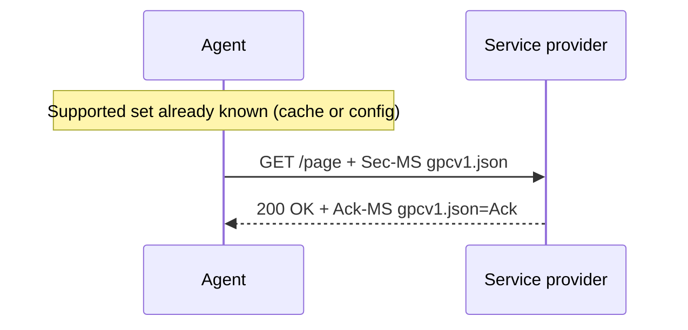
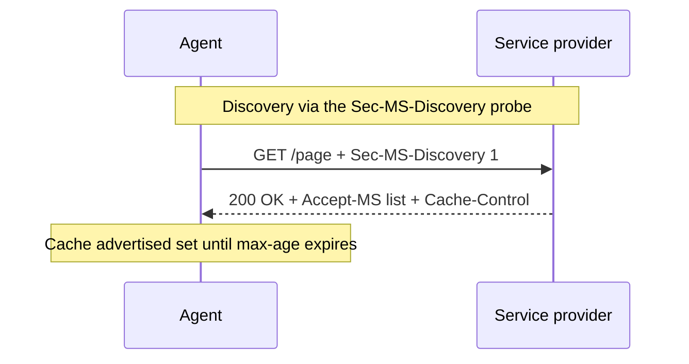
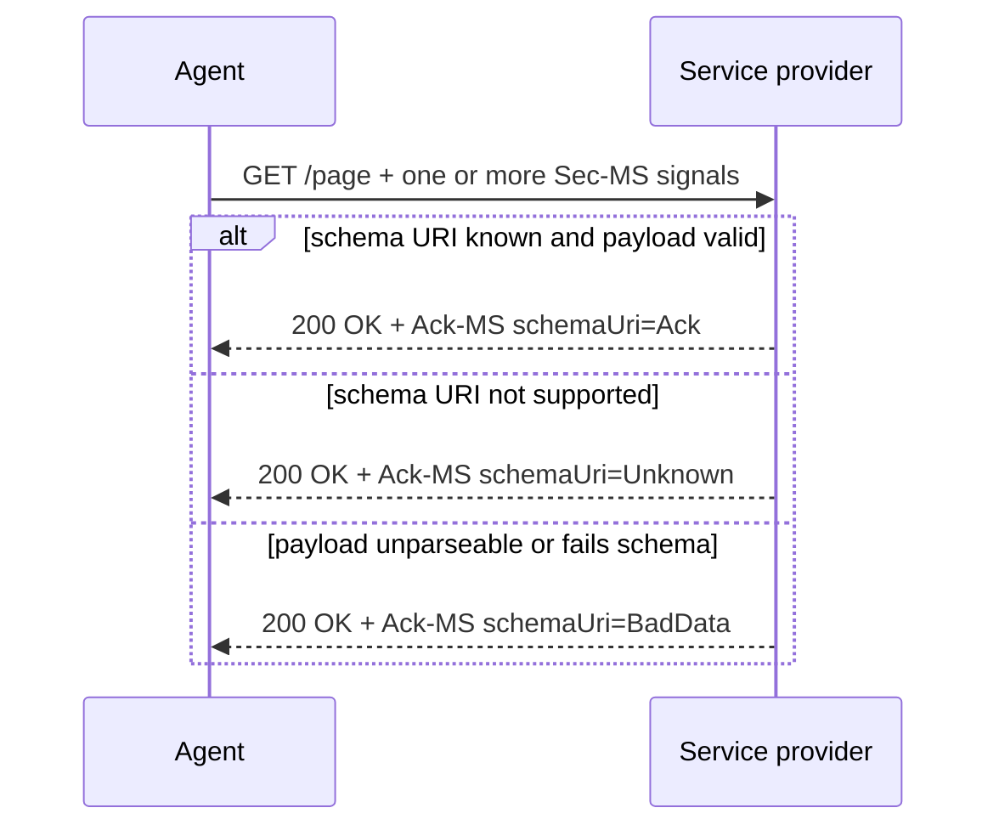
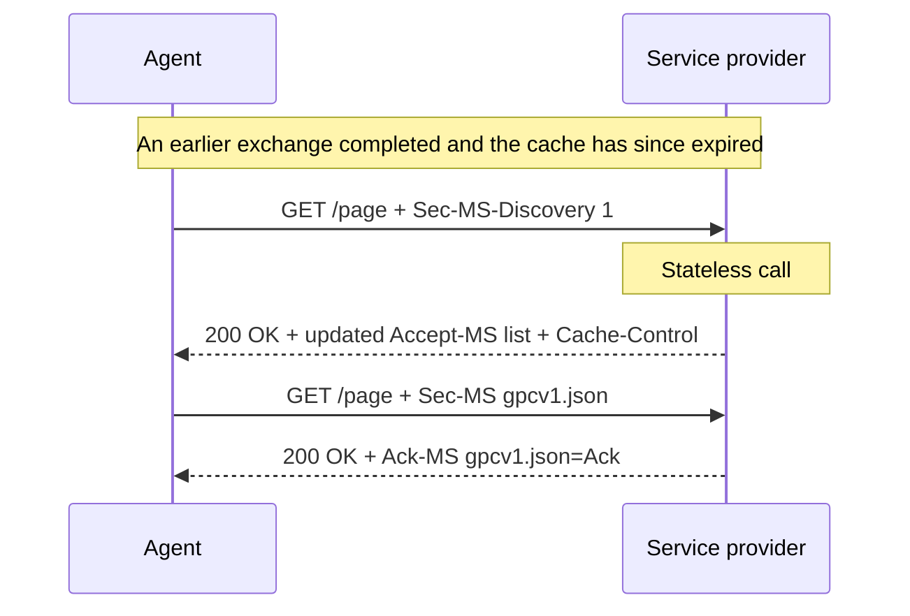

## 1. Introduction

_This section is non-normative._

The internet has evolved to exhibit a power asymmetry between organizations and individuals—an asymmetry that comes at the expense of the autonomy, agency, and privacy of the individual. The power imbalance between internet technology users and service providers (businesses and governments) has been recognized for some time. It was described over a decade ago by the World Economic Forum [**WEF2014**]:

<Callout type="example" title="World Economic Forum, 2014">
  An asymmetry of power exists today between institutions and
  individuals—created by an imbalance in the amount of information about
  individuals held by, or that is accessible to, industry and governments, and
  the lack of knowledge and ability of the same individuals to control the use
  of that information.
</Callout>

### 1.1 Background

For the past two decades, hundreds of independent developers and organized groups have explored different paths to restore the power imbalance we've described. A main thrust of this work is the development of personal agents and other kinds of “empowerment” tools that work “on the individual's side” [**ProjectVRM**] and represent their interests.

Possibly the simplest example of “empowerment” tooling is a browser that implements the Global Privacy Control [[**GPC**]](#ref-gpc). The GPC is a signal from the browser that communicates the person's Do Not Sell or Share request to the service provider. This signal is legally binding under the California Consumer Privacy Act, and similar state privacy laws that allow users to opt out of data sales or the use of their data for cross-context targeted advertising. The GPC signal was implemented by adding a `Sec-GPC: 1` field to the `User-Agent` HTTP header in HTTP request messages sent to the web server. For example:

```http
GET /something/here HTTP/2
Host: example.com
Sec-GPC: 1
```

### 1.2 Limitations of Current Approaches

Defining a custom `Sec-*` header field for each type of signal has disadvantages:

- Each signaltype adds its own type of field to the HTTP header. Doing so adds entropy to the header which increases the fingerprinting surface area exposed to the network, thereby increasing tracking and associated privacy risks.
- It broadcasts the signal to every website on every request, giving the person's agent (e.g. browser) no opportunity to first discover what a particular website supports and then decide which signals to send to it.
- The GPC field transmits one scalar value (in this case a single boolean) whereas other signals contain multiple parameters and more structure and complexity.

### 1.3 Purpose and Characteristics

MySignals defines a protocol by which a person's agent sends signals to a service provider website/app. It is an extensible communications protocol that allows developers to define specific kinds of signals (signaltypes) that can be sent. It defines a common namespace for these signaltypes and a syntax for passing parameters. It has these characteristics:

- It is **stateless**: every request is interpreted on its own, and a service provider never requires a prior exchange before honouring a signal.
- An agent MAY send one or more signals **proactively**, as `Sec-MS` request headers — each identifying the signal by its **schema URI** (§3.2) and carrying its payload — without any prior negotiation. A time-sensitive or legally binding signal such as GPC can therefore ride the very first request.
- **Discovery is optional and in-band.** An agent MAY first probe with a `Sec-MS-Discovery: 1` field; a supporting service provider responds with an `Accept-MS` field listing the schema URIs it supports. The advertisement is cacheable.
- The service provider **acknowledges** each received signal with a separate `Ack-MS` field reporting `Ack`, `Unknown`, or `BadData` for that signal's schema URI.
- Protocol is inspired by pattern similar to that used in [[**ClientHints**]](#ref-clienthints), reducing the fingerprinting surface area and network traffic.
- It supports structured, multi-parameter signals carried in the payloads.
- It supports HTTP/websites and any apps capable of sending HTTP requests.

## 2. Definitions

A **signaltype** is a _virtual human-readable_ name for a kind of signal a person can send to a service provider (see §4). On the wire a signal is not identified by this name but by its **schema URI** — the URL of the signal's definition (§3.2). Implementers of this spec MUST use the signaltypes defined in §4. The semantics of each signaltype are defined by an implementer — they are outside of the MySignals spec.

A signal carries a **payload**: a value whose shape is described by the signal's schema. The payload's contents and semantics are defined by the signaltype's definition and are out of scope of the MySignals spec.

## 3. Protocol

The protocol defines three interactions: an agent **submits** one or more signals and receives a per-signal **acknowledgement** in response, and MAY first **discover** what a service provider supports.

### 3.1 Statelessness

The protocol establishes no session. A service provider MUST NOT require a prior probe before honouring a submitted signal, and MUST NOT depend on remembering that any particular agent has probed before. Each request is interpreted on its own. This keeps the protocol correct across CDNs, retries, parallel tabs, and load-balanced origins. Any continuity an agent maintains (for example the SDK's stored protocol state, §5.2) is a purely client-side optimisation, not service-provider state.

### 3.2 Schema URIs and signal definitions

On the wire a signal is identified by its **schema URI** — the URL of the signal's **definition**. The definition is the source of truth for what a signal means and what shape its payload takes; it RECOMMENDED to be a JSON Schema document or a human-readable specification page. The definition and semantics belong to the signaltype and are out of scope of this specification.

A schema URI is **immutable**: a revised definition MUST be published at a new URL (for example `../myterms-v2.json`) rather than by mutating the existing resource. Because a definition cannot change in place, an agent MAY cache it indefinitely (§3.6).

### 3.3 Sending signals

An agent submits a signal by including a `Sec-MS` request header whose value is `<schemaUri>;<payload>` — the signal's schema URI (§3.2), a semicolon, then the payload (a scalar such as a boolean opt-out, or a structured JSON value, or any arbitrary structure defined in a schema). One `Sec-MS` header is sent per signal; repeat the header to send several. Examples of valid `Sec-MS` header values:

```http
GET /page HTTP/2
Host: example.com
Sec-MS: https://globalprivacycontrol.org/v1.json;1
Sec-MS: https://agreements.info/myterms-v1.json;{"contract":"P7012-DDA-1"}
```

```http
HTTP/1.1 200 OK
Ack-MS: https://globalprivacycontrol.org/v1.json=Ack
Ack-MS: https://agreements.info/myterms-v1.json=Ack
```

<Callout type="note" title="Sec- vs X- headers">
  `Sec-MS` and `Sec-MS-Discovery` are `Sec-` (forbidden) header names that only
  a user agent may set, so page scripts cannot forge them. That same restriction
  means scripts cannot *set* them either: the JS SDK uses the equivalent `X-MS`
  and `X-MS-Discovery` headers (§5.4). A service provider treats the `Sec-MS`
  and `X-MS` forms identically when processing and acknowledging signals.
</Callout>



### 3.4 Discovery (optional phase)

When an agent wants to learn what a service provider supports, it sends an in-band probe — a `Sec-MS-Discovery: 1` field. The probe is per-request and per-context, so it can reflect capabilities that vary by route, region, or authentication state. A supporting service provider responds with an `Accept-MS` header listing the schema URIs it supports, together with HTTP cache directives:

```http
GET /page HTTP/2
Host: example.com
Sec-MS-Discovery: 1
```

```http
HTTP/1.1 200 OK
Accept-MS: https://globalprivacycontrol/v1.json, https://agreements.info/myterms-v1.json
Cache-Control: public, max-age=86400
```

`Accept-MS` is a comma-separated list of schema URIs.



### 3.5 Acknowledgement

Whenever a request carries one or more `Sec-MS` (or `X-MS`) headers, the response MUST include one `Ack-MS` header for each received signal, mapping that signal's schema URI to exactly one status. As with `Sec-MS`, one header is sent per signal; the headers are not combined into one. The status is one of:

| Status    | Meaning                                                                                                           |
| --------- | ----------------------------------------------------------------------------------------------------------------- |
| `Ack`     | The schema URI is recognised, the payload is valid against its definition, and the signal was accepted/processed. |
| `Unknown` | The service provider does not recognise/support this schema URI.                                                  |
| `BadData` | The schema URI is recognised, but the payload is malformed or fails its definition schema.                        |

For each received signal the service provider determines the status as follows:

1. If the schema URI is not in the supported set → `Unknown`.
2. Otherwise decode the payload; if decoding fails → `BadData`.
3. Otherwise validate the decoded payload against the schema; if validation fails → `BadData`.
4. Otherwise → `Ack`.

Statuses are mutually exclusive and evaluated independently per signal, so a response can carry a mix of all three across its `Ack-MS` headers. The `Ack-MS` header appears **only when signals were received**: a bare probe (`Sec-MS-Discovery: 1` with no `Sec-MS` signals) produces only the `Accept-MS` advertisement, never an `Ack-MS`. An `Ack-MS` MAY accompany an `Accept-MS` advertisement (so-called "multiplexed response") on the same response when an agent probes and submits in one request.

**Unrecognised schema URI** — the agent learns to stop sending it:

```http
Sec-MS: https://example.com/defs/siopv2.json;{"client_id":"did:example:123"}
```

```http
Ack-MS: https://example.com/defs/siopv2.json=Unknown
```

**Recognised but invalid** — for example an out-of-range value:

```http
Sec-MS: https://globalprivacycontrol.org/v1.json;2
```

```http
Ack-MS: https://globalprivacycontrol.org/v1.json=BadData
```

**Mixed batch** — independent evaluation yields one entry per signal:

```http
Sec-MS: https://globalprivacycontrol.org/v1.json;1
Sec-MS: https://agreements.info/myterms-v1.json;{}
Sec-MS: https://example.com/defs/siopv2.json;{"client_id":"did:example:123"}
```

```http
Ack-MS: https://globalprivacycontrol/v1.json=Ack
Ack-MS: https://agreements.info/myterms-v1.json=BadData
Ack-MS: https://example.com/defs/siopv2.json=Unknown
```



### 3.6 Caching and signal discovery

Discovery is intended to be an inexpensive way to advertise supported signal types:

- **Discovery results.** The set of schema URIs advertised in `Accept-MS` MAY change over time and therefore be cached with a finite freshness lifetime and revalidation. A service provider MAY return standard HTTP caching directives — e.g., `Cache-Control` (`max-age`), `ETag`.
- **Definition resources.** Because a schema URI is immutable (§3.2), an agent MAY cache it indefinitely, and a service provider SHOULD serve it with `Cache-Control: public, max-age=31536000, immutable`.
- **Agent-side storage.** An agent MAY persist discovery results locally to avoid redundant probes. The JS SDK implements this with selectable `memory`, `sessionStorage`, and `localStorage` (24-hour TTL) strategies (§5.2).

An agent MAY re-request the supported set at any time, including after a prior exchange. Because the protocol is stateless (§3.1), a service provider MUST treat a fresh `Sec-MS-Discovery: 1` probe identically to a first-time request and MUST NOT suppress the advertisement on the basis of an earlier exchange. An agent re-discovers when its cached entry expires, when revalidation against the `ETag` fails, or at its discretion.

<Callout type="issue" title="Open: default TTLs">
  Default TTLs for the discovery result (versus the immutable definition
  resources) should be server-configurable.
</Callout>



## 4. Signaltypes

The MySignals protocol is designed to support a range of current and anticipated signaling needs. Use cases include:

- **MyTerms**: Negotiate and digitally sign mutually acceptable contracts related to privacy and data sharing using IEEE P7012. [[**IEEEP7012**]](#ref-ieeeP7012).
- **AgeVerified**: Signal the need for an age-appropriate experience from the service provider, and tell them which age verification and consent management endpoints you use. [[**AgeVerified**]](#ref-ageprotect).
- **Identity**: Tell the service provider who you are. Give them a (self-sovereign) digital identifier.
- **KERI-AID**: Proffer your KERI Autonomic identifier.
- **IdP**: Tell the service provider which IdP (identity provider(s)) you use. This solves the [[**NASCAR**]](#ref-nascar) problem.
- **SIOPv2**: Tell the service provider that your agent supports OpenID SIOPv2, allowing their site/app to display a “Continue with wallet” button for password-less login. [[**SIOPv2**]](#ref-siopv2).

## 5. JS SDK

The MySignals JS SDK is a zero-dependency JavaScript/TypeScript library that implements the protocol flow on any web page. It ships as ESM, CommonJS, and UMD; runs in modern bundlers (Vite, Webpack, Rollup) and directly in the browser via a `<script>` tag; and relies only on native APIs such as `fetch`.

### 5.1 API and lifecycle

`MySignalsClient` exposes a small lifecycle API:

| Method | Purpose |
|---|---|
| `init()` | Probes the server for `CRITICAL` and `ACCEPTED` signal requirements |
| `submit()` | Delivers the person's signals |
| `getStatus()` | Returns a snapshot of state, pending requirements, and errors |
| `reset()` | Clears session state and storage |

The protocol flow is modeled as a finite state machine:

```
IDLE → PROBING → PROBED → SUBMITTING → SUBMITTED
```

Errors move the client to `ERROR`, capturing the previous state for clean retry.

### 5.2 Capabilities

- **Storage** — persists protocol state in `memory`, `sessionStorage`, or `localStorage` (with a 24-hour TTL) to avoid redundant prompting.
- **Demo mode** — a built-in `DemoTransport` (`demo: true`) simulates latency, server requirements, and responses with no backend.
- **Logging** — a structured logger with `debug`, `info`, `warn`, `error`, and `silent` levels.
- **Cross-origin** — performs the protocol flow across domains, optionally attaching credentials/cookies to `fetch` requests.

### 5.3 Signal definitions and validation

Each entry in the `signals` map carries a required `definitionUri` — the SDK-side schema URI for the signal (§3.2). It may point to a JSON Schema document or a human-readable spec page, and as at the protocol level is treated as immutable: publish new versions at new URLs, e.g. `../myterms-v2.json`.

Validation is **advisory by default**; the server remains authoritative.

- If no validator is configured, the SDK skips fetching `definitionUri`.
- Set `strictValidation: true` to reject locally with `MySignalsErrorCode.SCHEMA_VIOLATION`.

The SDK stays dependency-free via a `SchemaValidator` interface — bring your own (Ajv example):

```ts
import Ajv from "ajv/dist/2020.js";
import { MySignalsClient, type SchemaValidator } from "mysignals-sdk";

const ajv = new Ajv({ strict: false });

const validator: SchemaValidator = {
  validate(schema, value) {
    const v = ajv.compile(schema);
    const valid = v(value);
    return valid
      ? { valid: true }
      : { valid: false, errors: (v.errors ?? []).map((e) => e.message ?? "") };
  },
};

const client = new MySignalsClient({ validator, strictValidation: false });
```

### 5.4 Wire format

The SDK uses script-accessible equivalents of the canonical user-agent headers: `Sec-` is a forbidden header name that page scripts cannot set, so service providers should honour both forms identically.

| Canonical (user agent) | SDK (page script) | Spec |
|---|---|---|
| `Sec-MS` | `X-MS` | §3.3 |
| `Sec-MS-Discovery` | `X-MS-Discovery` | §3.4 |

- Each signal is sent as an `X-MS` request header with the value `<schemaUri>;<payload>`.
- Payloads are JSON-encoded: strings pass through unchanged; objects, booleans, and numbers are `JSON.stringify`-ed. Schemas describe the value as the developer sees it, not the wire form.
- The SDK surfaces the service provider's per-signal `Ack-MS` results (`Ack` / `Unknown` / `BadData`, §3.5) to the caller.

{/*

## 6. Privacy Considerations

<Callout type="issue" title="To be written">
  This section will address privacy implications and considerations.
</Callout>

## 7. Security Considerations

<Callout type="issue" title="To be written">
  This section will address security implications and considerations.
</Callout>

## 8. Automation

<Callout type="issue" title="To be written">
  This section will address automation considerations.
</Callout>

## 9. Conformance

<Callout type="issue" title="To be written">
  This section will define conformance requirements.
</Callout>

## A. Implementation Considerations

<Callout type="issue" title="To be written">
  This appendix will provide implementation guidance and best practices.
</Callout>

## B. Acknowledgements

<Callout type="issue" title="To be written">
  This appendix will acknowledge contributors to this specification.
</Callout>
*/}
## A. References

### A.1 Normative references

- <span id="ref-json">
    **[JSON]** JSON spec. URL: https://www.rfc-editor.org/rfc/rfc8259
  </span>

### A.2 Informative references

- <span id="ref-ageprotect">
    **[AgeProtect]** AgeProtect paper. URL: https://ageprotect.org
  </span>
- <span id="ref-clienthints">
    **[ClientHints]** URL: https://wicg.github.io/ua-client-hints/
  </span>
- <span id="ref-gpc">
    **[GPC]** Global Privacy Control. URL: https://globalprivacycontrol.org
  </span>
- <span id="ref-nascar">
    **[NASCAR]** The "NASCAR problem" in authorization server selection refers
    to the visual clutter and user confusion when a website presents too many
    third-party login/identity provider (IdP) buttons (like Google, Facebook,
    Apple), resembling the crowded sponsorship decals on a NASCAR car. URL:
    https://apicrazy.com/2014/07/22/nascar-problem-in-authorisation-server-selection/
  </span>
- <span id="ref-ieeeP7012">
    **[IEEEP7012]** IEEE P7012. URL: https://standards.ieee.org/ieee/7012/7192/
  </span>
- <span id="ref-siopv2">
    **[SIOPv2]** URL:
    https://openid.net/specs/openid-connect-self-issued-v2-1_0.html
  </span>
- <span id="ref-wef2014">
    **[WEF2014]** Rethinking Personal Data: Trust and Context in User-Centred
    Data Ecosystems, World Economic Forum. URL:
    https://www3.weforum.org/docs/WEF_RethinkingPersonalData_TrustandContext_Report_2014.pdf
  </span>
